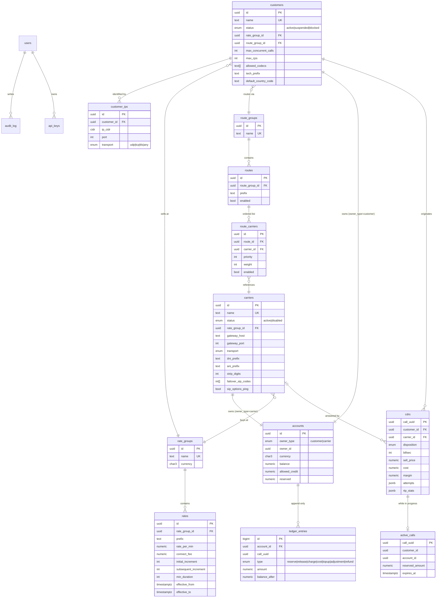

# OpenSBC Architecture

OpenSBC is a deliberately simple Session Border Controller with prepaid wholesale billing.
It is built from four runtime components and two data stores:

| Component | Technology | Responsibility |
|-----------|------------|----------------|
| `freeswitch` | FreeSWITCH 1.10.12 (image `safarov/freeswitch:1.10.12`) with two Sofia profiles | SIP signalling, B2BUA, RTP anchoring, transcoding, topology hiding, ACLs, session timers, gateway OPTIONS ping |
| `sbc_inbound.lua` | Lua 5.2 running inside `mod_lua` | The per-call state machine: asks the control plane what to do, executes bridges with failover, reports every attempt and the outcome |
| `sbc-api` | Go 1.26 single binary (`cmd/sbc-api`) | Internal Call Control API (for Lua), Admin REST API (for the UI), ESL consumer + `mod_json_cdr` receiver, billing engine, background workers, FreeSWITCH config renderer |
| `web` | React 18 + TypeScript + Vite + Tailwind v4 + shadcn/ui | Admin UI, served by nginx in Docker, talks only to the Admin REST API |
| `postgres` | PostgreSQL 16 | System of record: customers, carriers, rate decks, routes, accounts, ledger, CDRs, users, audit log, hourly roll-ups |
| `redis` | Redis 7 | Hot cache (IP to customer, prefix tries), reservation TTL keys, concurrency counters, CPS token buckets, pub/sub for cache invalidation and live UI |

## 1. Component diagram

```mermaid
flowchart LR
    subgraph Customers
        C1[Customer PBX / switch<br/>identified by source IP]
    end
    subgraph OpenSBC host
        FS[FreeSWITCH<br/>profile external-ingress :5060<br/>profile external-egress :5080]
        LUA[sbc_inbound.lua<br/>mod_lua]
        API[sbc-api (Go)<br/>internal API :8081<br/>admin API :8080]
        PG[(PostgreSQL)]
        RD[(Redis)]
        WEB[Web UI<br/>nginx :3000]
        FS --- LUA
        LUA -- "HTTP/JSON via mod_curl<br/>X-SBC-Secret" --> API
        FS -- "ESL events<br/>CHANNEL_HANGUP_COMPLETE" --> API
        FS -- "mod_json_cdr POST /internal/v1/cdr" --> API
        API -- "ESL api: sofia rescan, reloadacl, uuid_kill, show channels" --> FS
        API -- "renders gateways + acl XML<br/>(shared volume)" --> FS
        API --> PG
        API --> RD
        WEB -- "REST /api/v1" --> API
    end
    subgraph Carriers
        CA[Carrier A<br/>priority 1]
        CB[Carrier B<br/>priority 2]
        CC[Carrier C<br/>priority 3]
    end
    C1 -- "SIP INVITE + RTP" --> FS
    FS -- "SIP + RTP (gateway per carrier)" --> CA
    FS -.failover.-> CB
    FS -.failover.-> CC
```

Process boundaries:

* FreeSWITCH never talks to Postgres or Redis. All business rules live in Go.
* Lua never makes a decision on its own. It executes decisions returned by the API and reports facts back. The one local rule it enforces is fail-closed: if the API is unreachable or slow (2 s hard timeout) the call is rejected with `503 SBC internal error`.
* The Go binary is stateless except for in-memory caches that can be rebuilt from Postgres at any time. Two copies can run side by side against the same Postgres and Redis.

## 2. Call flow (successful call with one failover)

```mermaid
sequenceDiagram
    autonumber
    participant Cu as Customer (1.2.3.4)
    participant FS as FreeSWITCH ingress
    participant L as sbc_inbound.lua
    participant A as sbc-api
    participant PG as Postgres
    participant R as Redis
    participant CA as Carrier A
    participant CB as Carrier B

    Cu->>FS: INVITE sip:00447700900123@sbc
    FS->>L: dialplan: lua sbc_inbound.lua
    L->>A: POST /internal/v1/call/setup {call_uuid, src_ip, src_port, caller, called}
    A->>R: GET ip:1.2.3.4 (miss -> PG cidr >>= lookup, then SET)
    A->>R: INCR cc:<customer> / CPS token bucket
    A->>A: normalise number -> 447700900123
    A->>A: sell rate LPM (trie) -> 4477 UK Mobile 0.02/min
    A->>PG: BEGIN; UPDATE accounts SET reserved=reserved+0.10 WHERE available>=0.10 RETURNING ...
    A->>PG: INSERT ledger_entries(reserve, -0.10); INSERT cdrs(call_uuid, ... disposition pending); INSERT active_calls; COMMIT
    A->>R: SET resv:<uuid> EX 14400
    A->>A: route LPM -> [Carrier A (buy 0.015), Carrier B (buy 0.018)]
    A-->>L: 200 {action:"dial", max_call_seconds, carriers:[...dial strings...], vars:{...}}
    L->>FS: set sbc_* channel variables, sched_hangup on answer
    L->>FS: bridge sofia/gateway/carrier_a/447700900123
    FS->>CA: INVITE
    CA-->>FS: 503 Service Unavailable
    L->>A: POST /internal/v1/call/attempt {carrier_a, sip:503, cause NORMAL_TEMPORARY_FAILURE}
    A-->>L: {classification:"carrier_fault", continue:true}
    L->>FS: bridge sofia/gateway/carrier_b/447700900123
    FS->>CB: INVITE
    CB-->>FS: 183, 200 OK
    FS-->>Cu: 183, 200 OK (media anchored)
    L->>A: POST /internal/v1/call/attempt {carrier_b, answered}
    Note over Cu,CB: conversation, RTP relayed by FreeSWITCH
    Cu->>FS: BYE
    FS->>CB: BYE
    par first writer wins (idempotent on call_uuid)
        FS->>A: mod_json_cdr POST /internal/v1/cdr
    and
        FS->>A: ESL CHANNEL_HANGUP_COMPLETE
    end
    A->>PG: BEGIN; SELECT accounts FOR UPDATE; reserved-=0.10; balance-=price; ledger release/charge; carrier balance-=cost; UPDATE cdrs; DELETE active_calls; COMMIT
    A->>R: DEL resv:<uuid>; DECR cc:<customer>; PUBLISH cdr.completed
```

The `setup` endpoint collapses Section 3 steps 1 to 7 of the specification into a single round trip. Internally it is implemented as separate functions (`Authorize`, `Normalize`, `RateSell`, `CheckBalance`, `Reserve`, `Route`, `RateBuy`) with exactly the semantics of the specification, and the individual endpoints `/call/authorize`, `/call/rate`, `/call/reserve`, `/call/route` remain available and share the same functions.

### Rejection paths

Every rejection is a SIP response that Lua sends with `respond <code> <reason phrase>` before hanging up, so the customer sees exactly the reason phrase from the specification. A CDR row is written for every attempt, including rejections (`billsec = 0`).

| Step | Condition | SIP response | CDR disposition |
|------|-----------|--------------|-----------------|
| 1 | IP unknown | `403 IP not authorized` (`SBC_ACL_MODE=strict`: Sofia answers a bare `403 Forbidden` before the dialplan, no CDR) | `rejected_auth` |
| 1 | customer not active | `403 Customer suspended` | `rejected_auth` |
| 1 | concurrent calls exceeded | `480 Concurrent call limit` | `rejected_auth` |
| 1 | CPS exceeded | `503 CPS limit` | `rejected_auth` |
| 2 | number malformed | `484 Address Incomplete` | `rejected_route` |
| 3 | no selling rate | `404 No rate for destination` | `rejected_route` |
| 4/5 | insufficient funds | `402 Not enough funds` | `rejected_balance` |
| 6 | no route / no enabled carriers | `503 No route` | `rejected_route` |
| 8 | all carriers failed | last carrier fault code, or `503 All carriers failed` | `failed` |
| 8 | number fault from carrier | relayed carrier code (404, 486, ...) | `no_answer` / `busy` / `failed` |
| any | API unreachable / timeout | `503 SBC internal error` | `failed` (written by reconciliation if setup never reached the API) |

## 3. Data model



Invariants (proved by `make reconcile`):

* `accounts.balance == sum(ledger_entries.amount where type in (charge, cost, topup, adjustment, refund))` per account.
* `accounts.reserved == sum(active_calls.reserved_amount)` per account, and every `reserve` ledger entry for a finished call has a matching `release`.
* `available = balance + allowed_credit - reserved` is the only affordability formula, implemented once in SQL (`accounts_available(accounts)` function) and once in Go, both tested.

## 4. Money and time

* Postgres: `NUMERIC(18,6)` everywhere. Go: `github.com/shopspring/decimal`. JSON: strings (`"0.020000"`), never numbers.
* Rating rounds half-up to 6 decimal places; the UI rounds to 4 for display only.
* Durations are integer seconds (`billsec`, `duration`) and integer milliseconds (`pdd_ms`). Timestamps are `timestamptz` and RFC 3339 in JSON.

## 5. Concurrency and idempotency

* Reservation: `UPDATE accounts SET reserved = reserved + $amt WHERE id = $1 AND balance + allowed_credit - reserved >= $amt RETURNING *`. Row-level locking by the UPDATE itself serialises two concurrent calls from the same customer; the second sees the first's reservation and fails the WHERE clause, producing `402 Not enough funds`.
* Billing: `SELECT ... FROM cdrs WHERE call_uuid = $1 FOR UPDATE` then `billed_at IS NULL` guard. The first of (`mod_json_cdr` POST, ESL `CHANNEL_HANGUP_COMPLETE`, reconciliation worker) to commit wins; the others become no-ops.
* CDR insert: `INSERT ... ON CONFLICT (call_uuid) DO UPDATE` with column-level coalescing so partial information from different sources merges rather than overwrites.
* Redis counters are best-effort admission control; the ledger is the source of truth for money. If Redis is down the API fails closed for admission (503 SBC internal error) because a wholesale SBC must never allow unlimited free calls.

## 6. Caches and invalidation

| Cache | Store | Invalidation |
|-------|-------|--------------|
| IP to customer | Redis `ip:<addr>` (JSON, TTL 5 min) | `DEL` on customer_ips change, plus TTL |
| Rate tries | In-process per rate group | Redis pub/sub `ratedeck:changed <rate_group_id>` + full reload every 5 min |
| Route tries | In-process per route group | Redis pub/sub `routes:changed <route_group_id>` |
| Carrier gateway state | In-process, fed by ESL `sofia status gateway` poll every 10 s | n/a |
| Circuit breaker | Redis `cb:<carrier_id>` counters with TTL | time based |

## 7. Failure modes

| Failure | Behaviour |
|---------|-----------|
| `sbc-api` down | Lua `curl` times out after 2 s: `503 SBC internal error`. No money moves. FreeSWITCH keeps running. Gateway pings continue. |
| Postgres down | API `/readyz` fails; setup returns 503; existing calls continue; billing requests are retried by `mod_json_cdr` (disk spool) and by the ESL consumer's in-memory queue until Postgres returns. |
| Redis down | Admission fails closed (503). Billing still works (Postgres only). Caches fall back to Postgres queries. |
| Carrier gateway DOWN (OPTIONS ping fails) | Skipped in routing, shown DOWN in UI. |
| Carrier returns carrier-fault codes repeatedly | Circuit breaker marks it degraded for 60 s and it is tried last. |
| Customer hangs up during failover | `ORIGINATOR_CANCEL` stops the loop, reservation released, CDR `cancelled`. |
| Neither CDR POST nor ESL event arrives | Reconciliation worker: after reservation TTL + `orphan_timeout`, checks `show channels` over ESL; if the channel is gone the reservation is released and the CDR marked `failed` with reason `orphaned`. |
| Call exceeds funds | Impossible by construction: `sched_hangup +max_call_seconds` is set on answer, where `max_call_seconds = floor(available / rate_per_second)`. The true-up can exceed the reservation by at most one billing increment; that overrun is charged against `allowed_credit`. |
| FreeSWITCH restarts | In-flight calls drop. Reconciliation worker releases their reservations. Gateways and ACLs are re-rendered from the DB on API start and on FS reconnect. |

## 8. Repository layout

```
cmd/sbc-api/            main: wires config, DB, Redis, ESL, HTTP servers, workers
internal/config         env-var configuration + failover.yaml
internal/db             pgx pool, goose migrations (embedded)
internal/rating         pure: BilledSeconds, Amount
internal/numbering      pure: E.164 normalisation
internal/prefix         pure: longest prefix trie
internal/failover       pure: classification, circuit breaker
internal/callcontrol    setup pipeline (authorize, rate, reserve, route)
internal/billing        end-of-call billing, reconciliation
internal/store          Postgres repositories
internal/cache          Redis helpers (ip cache, counters, reservations, pub/sub)
internal/esl            minimal FreeSWITCH Event Socket client
internal/fsconfig       renders gateway and ACL XML, triggers rescan
internal/httpapi        chi routers: internal API, admin API, health, metrics
internal/auth           argon2id, JWT, sessions, RBAC, API keys
internal/reports        report SQL and roll-up worker
migrations/             goose SQL migrations
freeswitch/conf/        pruned FreeSWITCH configuration
freeswitch/scripts/     sbc_inbound.lua and sbc/*.lua modules
web/                    React admin UI
deploy/                 compose fragments, grafana, nginx
tests/e2e/              sipp scenarios and the Go e2e runner
docs/                   this file, DECISIONS, CALL_FLOW, BILLING, API, OPERATIONS, ROADMAP
```
